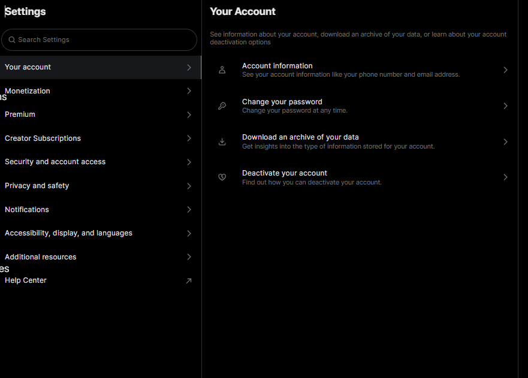
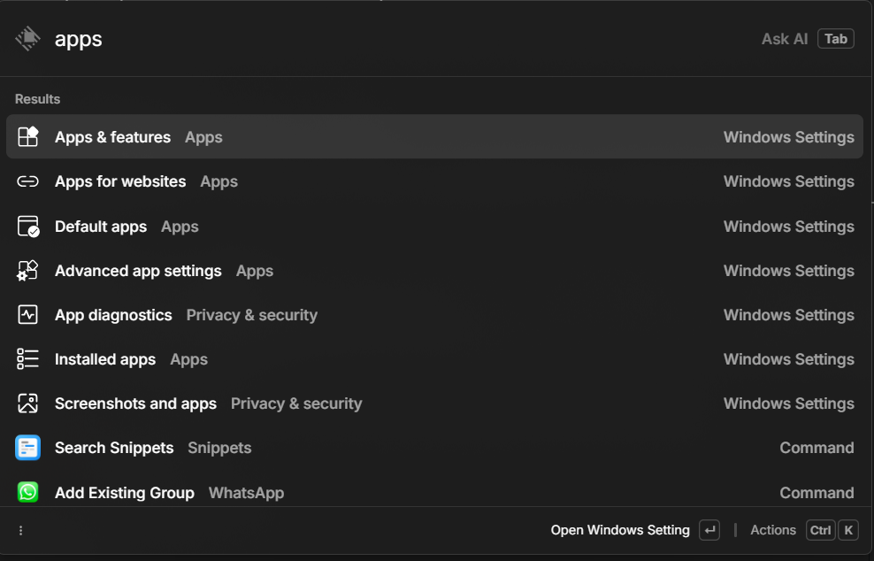

Search is the main feature:
What are the things that can be searched?
1. users
2. Dms
3. Bookmarks
4. saved lists
5. communities
6. navigation
6. your own posts and replies
7. posts and replies of others

X has a search functionality for everything,except for navigation, your own posts and replies, and the posts and  replies of others. All we need to do is play the game of correct api request. Network tab will help for that.

We will use a portal (different view) for each type of search and assign each one a prefix.

example-
Want to search a user?
press @ -> navigated to a portal -> search

Things like searching bookmarks, saved lists and communities are pretty straight forward, no need for explanation. Just make the items searchable inside a different portal.

1. User search:
(leave it to priyam)

2. Navigation:
Navigation has a lot of things to search. Literally every single page, every single sub page on X.com will be indexed.
To make things less cluttered and for better UX, we will need to deeply nest the navigation items, exactly like they are nested in the X app.
Example-

Navigation will be the only feature that is not categorized inside a portal. Meaning it can be searched in the root view.

raycast is a good example here. It does has things categorized, and the items of the categories are displayed in the root search too. This feature is already in the library,

3. DM search:
**Feautue 1**
(this is very similar to the normal user search)
Prefix(!dm) -> portal -> search the existing dms
ex-
query-"a" filters people in the dm. Choose a person and go to the dm.

**Feature 2**
A unified prefix system.
Example-

Lets take this calculator feature of racast as example.
You can just add as many operators as you want.

similarly, we can combine different prefixes.
so for dm it would be-
@ "elon musk" !dm "adopt me please" - this will instantly send a dm to elon musk
**Note**: combining different prefixes is not possible with the current library. So improvements have to be made. Make the changes in the way that it is useful for other users too not just our current usecase.

4. your own posts and replies
5. posts and replies of others
This i dont know how to implement or if its possible.